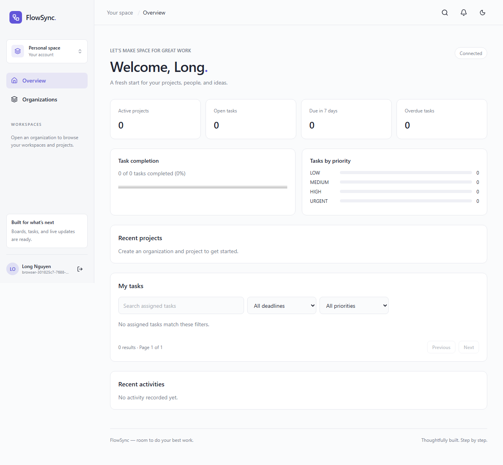
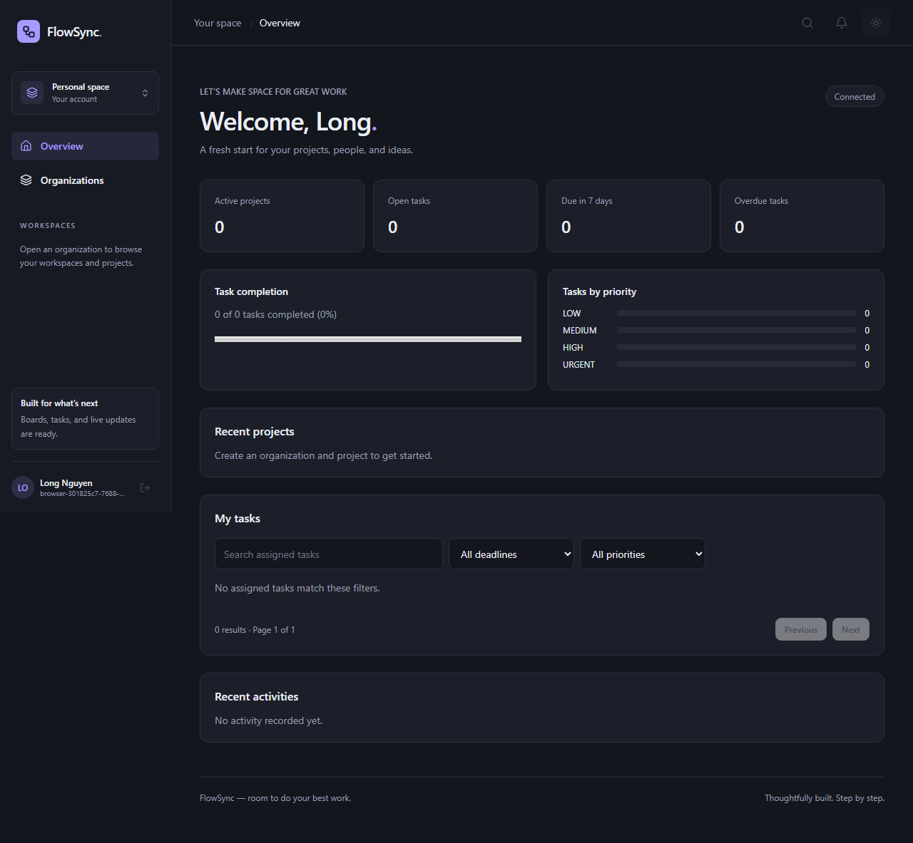
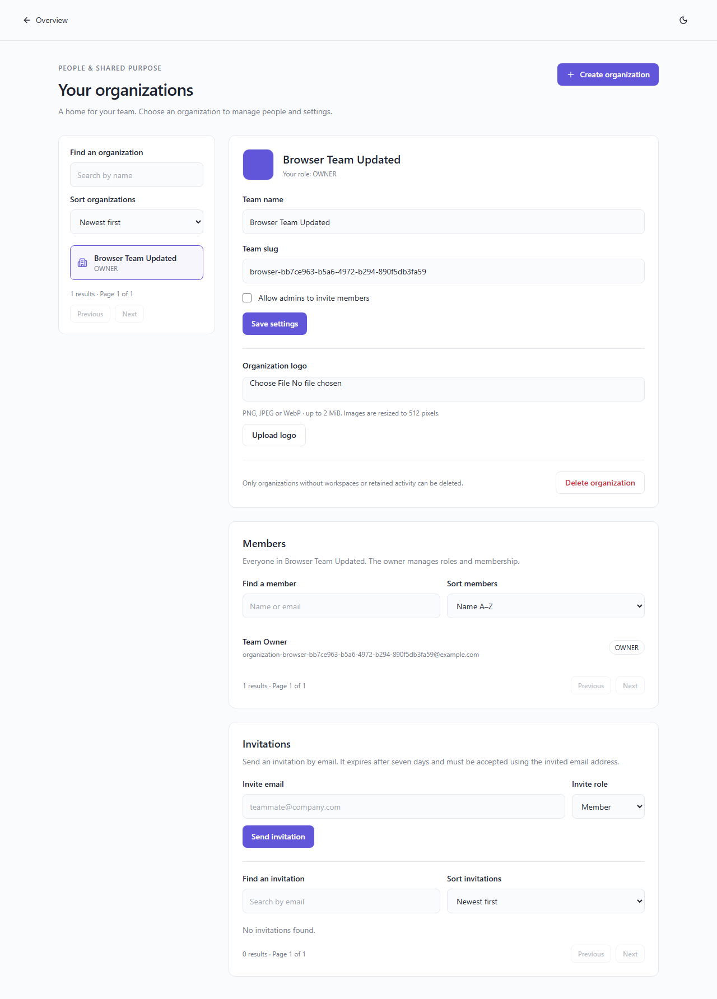
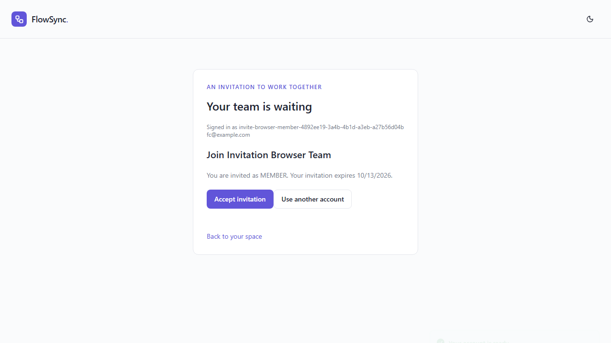
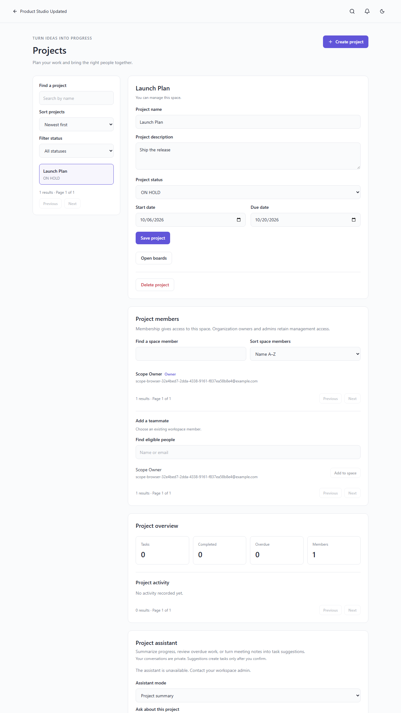
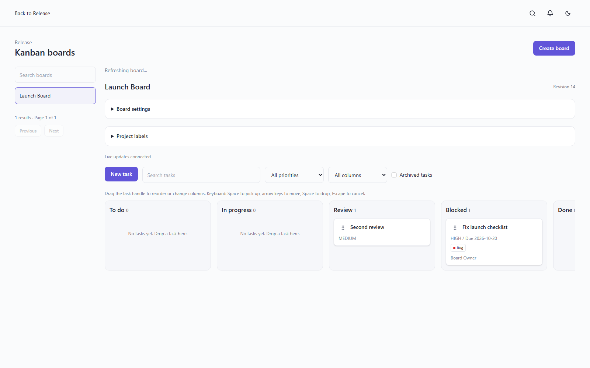
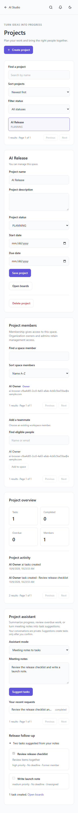
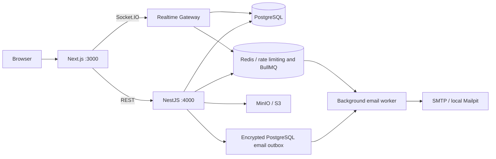

# FlowSync

A team collaboration platform bringing projects, Kanban boards, conversations, and a private AI assistant into one calm workspace. Built as a fullstack engineering portfolio with explicit tenant boundaries and production deployment in mind.

**Current delivery: Phase 8 — private project assistant; Phase 9 in progress.** Summary/overdue analysis and meeting-note previews use validated, scoped context. Tasks are created only after user selection and explicit confirmation.

## Features shipped

- Next.js App Router, React, strict TypeScript, Tailwind CSS, shadcn-compatible primitives, dark/light theme, React Hook Form + Zod, TanStack Query.
- Modular NestJS REST API; Swagger, structured logs, request IDs, health probes, uniform response/error envelopes.
- Argon2id passwords, short-lived Bearer access JWT, HttpOnly refresh cookie, atomic token rotation, replay detection and session-family revocation.
- Backend validation, Origin protection, strict CORS, Helmet, Redis-backed throttling, no token storage in localStorage.
- Tenant-scoped organization lists with pagination, filtering and sorting; reusable OWNER/ADMIN/MEMBER policy with permission checks against current database membership.
- Organization settings, private PNG/JPEG/WebP logos, member role/removal controls and atomic ownership transfer. Owner controls have explicit confirmation for destructive actions.
- Workspace/project CRUD with private membership boundaries, OWNER/ADMIN management, project owner controls, status/date validation and paginated lists. Member removal clears descendant memberships and assignments.
- Real project overview with task/completed/overdue/member counts and recent activity; responsive workspace/project settings and membership screens.
- Scoped boards and custom columns; task CRUD, priority/due dates, multiple assignees, project labels, checklists and archive/restore. Pointer and keyboard drag/drop with optimistic rollback, task versions and board revisions prevent lost updates.
- JWT-authenticated Socket.IO with Redis fanout across API replicas, immediate board access revocation, expiring presence leases and reconnect recovery. Transactional task notifications with a live unread badge, paginated inbox, read controls and task deep links.
- Live task comments with scoped member mentions, versioned edits and moderation; transactional task/project activity history. Private 10 MiB attachments with content validation, download authorization and durable object cleanup records.
- Global search across accessible tasks, projects, organization members and comments. Assigned task filters and actual dashboard counts, recent projects/activity, task completion and priority charts.
- Single-use, seven-day invitations with matching-email acceptance. Durable encrypted delivery outbox, BullMQ retry worker and local Mailpit SMTP capture.
- Transactional notification email outboxes and versioned due reminders; file cleanup workers, scoped retention, failed-job status and manual recovery commands. See [Phase 7 operations](docs/phase7.md).
- Private queued AI requests with OpenAI/Gemini adapters, strict output validation, bounded project context and atomic confirmed task creation. See [Phase 8](docs/phase8.md); live provider credential smoke testing remains pending.
- PostgreSQL + Prisma 7 schema for the complete planned domain, checked-in initial migration.
- Docker Compose PostgreSQL, Redis, private MinIO bucket, Mailpit, migration job, frontend, backend and worker containers. Random local secrets generated by setup.
- Security unit tests, real-service HTTP integration tests, browser account/organization/invitation tests and CI workflow.

## Screenshots

Screenshots are generated by `npm run test:browser` from the running application.










## Architecture



[Architecture and design decisions](docs/architecture.md) cover all A–J requirements: components, repository structure, relationships, auth, RBAC, realtime ordering, queues, MVP milestones, risks, and initial setup. [Roadmap](docs/roadmap.md) defines acceptance criteria for each phase.

## Tech stack

Node.js 22.12+ (22 LTS recommended), npm 10+, Next.js 16, React 19, NestJS 11, TypeScript strict, PostgreSQL 17, Prisma 7 with PostgreSQL driver adapter, Redis 7.4, S3-compatible storage. Exact dependency versions are recorded in `package-lock.json`. Nest 11 is used because the selected Nest ecosystem packages currently declare support for it; Prisma 8 prereleases are excluded.

## Database design

`User → Organization → Workspace → Project → Board → Column → Task`, with explicit membership tables and children for assignment, labels, checklist, comments, mentions, attachments, notifications, activity and AI history. UUID identifiers, unique constraints, listing indexes, restrictive structural deletes, targeted cascade for owned child records. Task status derives from its column; Decimal positions and board revision prepare for transactional moves.

See [schema.prisma](apps/api/prisma/schema.prisma). Schema preparation does not mean all domain features are implemented.

## Getting started

Prerequisites: Node.js 22.12+, npm, Docker Desktop running Linux containers. The first MinIO build compiles pinned upstream Go source and may take several minutes; subsequent builds use the Docker cache. This avoids relying on removed MinIO community registry images.

```bash
npm ci
npm run setup
npm run infra:up
npm run db:generate
npm run db:deploy
npm run dev
```

Open [localhost:3000](http://localhost:3000). Create a real account through the registration screen; no demo password is seeded. API docs: [localhost:4000/api/docs](http://localhost:4000/api/docs). MinIO console: [localhost:9001](http://localhost:9001) using the credentials in your local `.env`.

Open **Organizations** from the dashboard to create/select a team. `npm run dev` starts the email worker alongside API/web. Local invitation emails appear in [Mailpit](http://localhost:8025); open the invite link there and sign in or register using the recipient email. The link survives the authentication flow. You can also run `npm run worker:dev` separately when running API/web individually.

These are default ports. If a port is occupied, configure `WEB_PORT` with matching `WEB_URL`, `REDIS_PORT`, `POSTGRES_PORT` with matching `DATABASE_URL`, or `MINIO_API_PORT` with matching `MINIO_ENDPOINT` / `MINIO_PUBLIC_ENDPOINT` and `MINIO_CONSOLE_PORT`. This workspace currently uses web **3100**, Redis **16379**, and MinIO **19000/19001** to coexist with other local projects; API remains **4000**.

`npm run infra:up` starts infrastructure including Mailpit. `npm run infra:down` stops services and preserves named volumes. Changing database/storage passwords after initializing volumes requires an explicit credential update. On upgrades, rerun `npm run setup`: it adds missing Phase 2 configuration while preserving existing credentials.

Select **Open workspaces** inside an organization, then **Open projects** inside a workspace. Owners/admins create and manage these spaces. Ordinary members need explicit workspace membership and project membership; project owners may manage their own project while those memberships remain valid.

Select **Open boards** inside a project to create a board with four default columns. Members create tasks; creators/assignees/managers can edit or move them. Drag the task handle with a pointer, or use Space → arrow keys → Space; task details also provide a column selector. Stale moves return 409 and refresh the board. [Kanban implementation details](docs/phase4.md) explain ranking, permissions and limits.

## Environment variables

`.env.example` documents configuration; `npm run setup` generates `.env` with cryptographically random **local** credentials. Never commit `.env`; use a secret manager in production.

| Variable                                          | Purpose                                                               |
| ------------------------------------------------- | --------------------------------------------------------------------- |
| DATABASE_URL / POSTGRES_*                         | API/migration connection and local Compose database                   |
| REDIS_HOST / PORT / PASSWORD                      | Auth rate limiting and BullMQ email queue                             |
| JWT_ACCESS_SECRET / JWT_REFRESH_SECRET            | Distinct JWT signing secrets, minimum 32 characters                   |
| JWT_ISSUER / JWT_AUDIENCE                         | Token boundary validation                                             |
| WEB_URL                                           | Exact allowed frontend origin, no trailing slash; HTTPS in production |
| NEXT_PUBLIC_API_URL                               | Browser API URL, embedded at frontend build time                      |
| API_PORT / TRUST_PROXY_HOPS                       | HTTP listener, explicitly trusted proxy depth                         |
| MINIO_ENDPOINT / ACCESS_KEY / SECRET_KEY / BUCKET | Private S3-compatible bucket and credentials                          |
| MINIO_PUBLIC_ENDPOINT                             | Browser-reachable endpoint used to sign five-minute private logo URLs |
| S3_REGION                                         | Signing region                                                        |
| SMTP_URL / EMAIL_FROM                             | SMTP transport and sender; blank SMTP_URL uses localhost Mailpit      |
| EMAIL_ENCRYPTION_KEY                              | 64 hex characters for AES-256-GCM invitation delivery encryption      |
| MAILPIT_SMTP_PORT / MAILPIT_HTTP_PORT             | Local email capture ports (1025 / 8025)                               |
| AI_PROVIDER / AI_MODEL                            | disabled (default), openai or gemini; explicit model when enabled     |
| OPENAI_API_KEY / GEMINI_API_KEY                   | Key for the selected assistant provider                               |
| GOOGLE_*                                          | Reserved OAuth configuration, currently unused                        |

## Docker setup

Run `npm run setup` first, then:

```bash
docker compose up -d --build
```

Compose builds the app, waits for infrastructure health, initializes a private bucket, and runs `prisma migrate deploy` before the API. API/web run as non-root users. All host ports bind to loopback. Local Compose runs the compiled API with development cookie settings for HTTP localhost; production requires `NODE_ENV=production` and HTTPS. This Compose file is a local development environment, not an internet-facing deployment.

The separate worker container sends email through Mailpit. API storage uses the internal MinIO endpoint; signed logo URLs use `MINIO_PUBLIC_ENDPOINT` so the browser can reach them. Production SMTP and public storage endpoints require deployment-specific overrides.

## API documentation

| Endpoint                                                     | Purpose                                                    |
| ------------------------------------------------------------ | ---------------------------------------------------------- |
| POST /api/auth/register                                      | Name, email, password (12–128 characters), creates session |
| POST /api/auth/login                                         | Email/password                                             |
| POST /api/auth/refresh                                       | Rotate HttpOnly cookie, no Bearer token required           |
| POST /api/auth/logout                                        | Revoke current family and clear cookie                     |
| GET /api/auth/me                                             | Bearer-protected public user                               |
| GET /api/health/live                                         | Process liveness                                           |
| GET /api/health/ready                                        | PostgreSQL, Redis and private bucket reachability          |
| GET /api/docs                                                | Interactive OpenAPI                                        |
| POST /api/organizations                                      | Create organization and OWNER membership atomically        |
| GET /api/organizations                                       | Membership-scoped paginated list                           |
| GET /api/organizations/:id                                   | Read a joined organization                                 |
| PATCH /api/organizations/:id                                 | Owner updates name, slug and admin invitation policy       |
| DELETE /api/organizations/:id                                | Owner deletes an organization without workspaces/audit     |
| POST /api/organizations/:id/logo                             | Owner uploads a verified image (multipart `file`)          |
| GET /api/organizations/:id/members                           | Paginated member profiles                                  |
| PATCH /api/organizations/:id/members/:userId                 | Owner changes ADMIN/MEMBER role                            |
| DELETE /api/organizations/:id/members/:userId                | Owner removes a non-owner member                           |
| POST /api/organizations/:id/transfer-ownership               | Owner transfers to an existing member                      |
| GET, POST /api/organizations/:id/invitations                 | List/create authorized invitations                         |
| POST /api/organizations/:id/invitations/:invitationId/revoke | Revoke pending invite                                      |
| POST /api/invitations/preview                                | Authenticated matching-email preview, token in body        |
| POST /api/invitations/accept                                 | Single-use matching-email acceptance, token in body        |

Success: `{ "data": ..., "meta": {} }`. Lists accept `page`, `limit`, `search`, `sort=name|createdAt`, `order=asc|desc` and return `meta: { page, limit, total, totalPages }`. The `name` sort maps to member name or invitation email where appropriate. Errors: `{ "statusCode": 400, "code": "VALIDATION_ERROR", "message": "Invalid input", "errors": [], "requestId": "..." }`.

OWNER controls settings, roles, removal, deletion and ownership. ADMIN can invite MEMBER only when the organization allows admin invitations; OWNER may invite ADMIN. MEMBER reads organization/member information. Unknown or foreign organization resources return 404. Role changes are checked from the database on each action.

Cookie flow assumes frontend/API on the same site (localhost on separate ports locally; shared parent domain or reverse proxy in production). Cross-site deployments need an explicit SameSite/CSRF design. Logout revokes refresh immediately; already-issued access JWT remains valid up to 15 minutes. Web Locks serialize cookie rotation across tabs on supported secure contexts, with per-tab single-flight as fallback. Tokens remain in memory.

### Workspace/project API

`POST, GET /api/workspaces` create/list with required `organizationId`; `GET, PATCH, DELETE /api/workspaces/:id` read/update/delete. `/api/workspaces/:id/members` lists/adds existing organization members; `DELETE /api/workspaces/:id/members/:userId` removes workspace and descendant project access.

`POST, GET /api/projects` create/list with required `workspaceId` and optional status filter; `GET, PATCH, DELETE /api/projects/:id` read/update/delete. `/api/projects/:id/members` lists/adds workspace members; `DELETE /api/projects/:id/members/:userId` removes a non-owner member. `POST /api/projects/:id/transfer-ownership` chooses an existing member. `GET /api/projects/:id/overview` returns actual counts and recent activity.

Creation automatically adds the creator to parent/member scopes. Patch fields stay absent when omitted; start/due dates are validated against both submitted and existing values. Structural deletion refuses existing child work or retained history.

## Validation

```bash
npm run db:validate
npm run typecheck
npm run lint
npm run format:check
npm run build
npm test
npm run test:e2e
npx playwright install chromium
npm run test:browser
```

HTTP tests require local PostgreSQL/Redis/MinIO/Mailpit and deployed migrations. They start an isolated API on a random port, use unique test accounts, and delete only their records afterward. Browser tests clean their own accounts/organizations and produce screenshots. The invitation browser test starts its own worker with SMTP forced to local Mailpit and deletes only its captured messages. Run integration tests against a development/test database, since they write test records.

Unit tests cover auth boundaries, RBAC and encrypted invitation payloads. HTTP tests add tenant isolation, role/owner invariants, concurrent transfer/acceptance, invitation expiry/reuse/revocation, actual SMTP delivery and hostile image uploads. Browser tests cover desktop/mobile organization management, two-account role changes, SMTP invitations, matching-email registration and replay rejection.

Phase 8 test suite: **28 unit + 87 HTTP integration + 10 browser tests**. See [verification.md](docs/verification.md) for verified runtime results.

## System design decisions and challenges

Modular monolith keeps tenant authorization and transactions understandable. Organization mutations lock the organization row and recheck permissions inside the transaction. A PostgreSQL partial unique index permits only one pending invitation per organization/email. Delivery tokens are encrypted in the transactional outbox; Redis receives only an opaque outbox ID. Five SMTP attempts use exponential backoff; acceptance remains single-use even if a crash causes duplicate email delivery. See [Phase 2 design](docs/phase2.md).

## Production deployment and future improvements

[Deployment notes](docs/deployment.md) describe TLS/cookie settings, migration sequencing, SMTP/storage credentials, backups and rollout checks. CI is included; cloud deployment is not provisioned. Next steps: production hardening/deployment and live provider smoke testing. Follow [roadmap.md](docs/roadmap.md).

Use small Conventional Commits, e.g. `feat(members): add atomic ownership transfer`. Changes are committed in functional slices and pushed to `main` after each commit. Setup only configures the environment.
