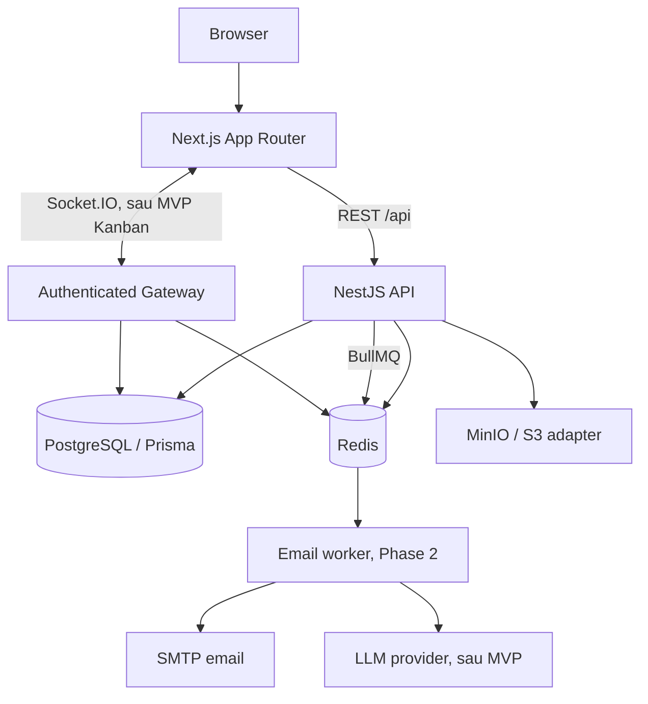

# FlowSync — thiết kế hệ thống

## A. System architecture

FlowSync dùng **modular monolith**, monorepo npm workspaces. Một API NestJS là nguồn dữ liệu chính; Next.js chỉ xử lý trình bày và client state. PostgreSQL giữ dữ liệu bền vững; Redis giữ dữ liệu tạm và làm transport cho queue/realtime. Chưa cần microservices.



- **Web:** App Router, TypeScript strict, Tailwind, các UI primitive theo cấu trúc shadcn/ui, TanStack Query, React Hook Form + Zod. Access token chỉ nằm trong bộ nhớ. Auth bootstrap qua refresh cookie. Không lưu token vào localStorage.
- **API:** controller mỏng, service chứa business logic, DTO validate bằng Zod, response/error thống nhất, request ID + Pino logging. `/api/docs` là Swagger; `/api/health/live` và `/api/health/ready` phục vụ probes.
- **PostgreSQL:** source of truth, migration versioned, transaction cho nghiệp vụ nhiều bước. Không dùng `db push` trong production.
- **Redis:** rate limiting và BullMQ email queue hiện tại; distributed presence và Socket.IO adapter ở Phase 5.
- **Storage:** private bucket, endpoint S3-compatible. Upload/download phải qua permission check, metadata nằm trong database. Health probe xác minh MinIO đã sẵn sàng và bucket tồn tại.
- **Worker:** process riêng khi triển khai jobs, chia sẻ use cases với API; retries phải đi cùng idempotency.

## B. Repository structure

```text
apps/
  web/                 Next.js, app/, components/ui/, lib/
  api/
    prisma/            schema, migrations
    src/
      common/          HTTP conventions, guards, validation
      config/          validated ENV
      database/        Prisma service
      modules/
        auth/          sessions, passwords, tokens
        health/        liveness/readiness
        authorization/ reusable organization policy/guard/service
        organizations/ CRUD, members, invitation, logo
        files/         private S3 adapter cho logo
        queue/         encrypted email outbox, BullMQ + SMTP worker
        workspaces/ projects/ boards/ tasks/ (milestones sau)
        comments/ notifications/ realtime/ activity-log/ ai/ (sau)
    test/              integration + HTTP e2e
packages/contracts/    Zod schemas + types dùng chung, không chứa secrets
docs/                  architecture, roadmap, deployment
scripts/               setup môi trường và kiểm tra
.github/workflows/     reproducible CI
```

Chỉ tạo module khi có hành vi thực tế; không tạo hàng loạt module rỗng. Shared contracts không phụ thuộc Nest/Prisma để frontend không import backend.

## C. Database design

Schema Prisma được chuẩn bị cho toàn domain. Phase 2 expose auth/health và organization/members/invitations/logo. Workspace/project/task chưa có endpoint.

| Entity                            | Relationship / constraint chính                                                                       |
| --------------------------------- | ----------------------------------------------------------------------------------------------------- |
| User                              | Email chuẩn hóa duy nhất; password hash không được serialize ra API                                   |
| Account                           | OAuth provider + providerAccountId duy nhất; Google chưa triển khai                                   |
| RefreshToken                      | Session family, token hash duy nhất, expiry, revokedAt; cascade khi xóa user                          |
| Organization / OrganizationMember | OWNER/ADMIN/MEMBER; membership unique organization + user                                             |
| Invitation                        | Hash token, email, role, expiry, status; liên kết organization và inviter                             |
| EmailOutbox                       | Invitation duy nhất, payload AES-256-GCM, enqueuedAt/deliveredAt; xóa payload khi đã gửi hoặc invalid |
| Workspace / WorkspaceMember       | Workspace thuộc organization; slug unique trong organization                                          |
| Project / ProjectMember           | Project thuộc workspace; owner và thành viên; trạng thái, start/due date                              |
| Board / Column                    | Board thuộc project; revision phục vụ concurrency; thứ tự column unique                               |
| Task                              | Column, creator, priority, Decimal position, version, archive/due date; status suy ra từ Column.kind  |
| TaskAssignee / TaskLabel / Label  | Many-to-many; label giới hạn theo project                                                             |
| Checklist / ChecklistItem         | Task có nhiều checklist; thứ tự item và completed                                                     |
| Comment / Mention                 | Author, task, text; mentions unique comment + user                                                    |
| Attachment                        | Task, uploader, object key unique, MIME và byte size                                                  |
| Notification                      | Recipient, loại, readAt, optional task; index recipient/read/createdAt                                |
| Activity                          | Organization/project/task + actor, action, JSON metadata; audit giữ lại khi actor bị xóa              |
| AIConversation / AIMessage        | Project + user; messages theo role; implementation sau MVP                                            |

Foreign keys + unique constraints bảo vệ quan hệ và thứ tự; indexes phục vụ membership, listing, overdue, activity và notification. Xóa cấu trúc cha dùng **Restrict** với workspace/project/board/column để tránh vô tình xóa toàn tenant. Xóa task dùng cascade cho dữ liệu con trực tiếp (checklist/comment/assignment); actor nullable dùng SetNull để giữ audit. Xóa user phải chuyển ownership hoặc xử lý các tham chiếu Restrict trước.

Các invariant xuyên tenant (assignee thuộc project, column cùng board, label cùng project) được kiểm tra tại service trong transaction; foreign key đơn lẻ không đủ bảo vệ chúng. Domain chưa expose nên chưa có đường ghi bypass kiểm tra này.

## D. Authentication design

1. Register/login validate input, chuẩn hóa email, hash Argon2id. Login luôn verify hash (kể cả email không tồn tại) để giảm timing enumeration.
2. Ký access JWT 15 phút với issuer/audience + `sub`. Trả access token trong response, refresh JWT đặt trong **HttpOnly cookie**, SameSite=Lax, Secure ở production, path `/api/auth`. API business dùng Bearer access token, không dùng cookie access.
3. Refresh JWT có `jti` và session family `sid`, secret riêng. Chỉ lưu SHA-256 của token trong DB, không lưu plaintext. Refresh được thực hiện transaction: consume token bằng update có điều kiện revokedAt=null rồi tạo token kế tiếp.
4. Replay token đã rotate thu hồi toàn family. Refresh concurrent từ cùng browser được client serialize bằng single-flight; multi-tab là một rủi ro cần bổ sung coordination trước scale.
5. Logout thu hồi family, xóa cookie. Token access hiện hành có thể còn hợp lệ đến 15 phút; middleware không thực hiện truy vấn DB mỗi request. Logout mọi thiết bị/instant access revocation là milestone hardening.
6. Cookie endpoints có Origin check; CORS chỉ cho WEB_URL; browser cross-site không origin bị từ chối. Non-browser clients không gửi Origin được dùng API; CORS không thay thế authentication.
7. Redis-backed rate limit cho auth và API, dùng IP của kết nối. Chỉ cấu hình trusted proxy khi deploy sau proxy đã biết. Password/token/cookie/Authorization được redact trong logs.

## E. RBAC design

Authentication guard xác định user. Phase 2 dùng permission service + decorator/guard, resolve organization membership từ DB và kiểm tra lại dưới row lock cho mutations. Thiếu resource/membership trả 404. OWNER quản lý settings/role/ownership/delete; ADMIN chỉ invite MEMBER nếu organization cho phép; MEMBER đọc organization và member profiles. Workspace/project permissions sẽ được triển khai ở Phase 3.

Organization membership không tự động cho MEMBER truy cập mọi private workspace/project. Admin/owner bypass scope phải được policy cho phép rõ ràng. Dùng reusable permission service + decorators/guard, rồi kiểm tra resource trong use-case; frontend ẩn nút chỉ hỗ trợ UX. Socket join và worker actions phải dùng cùng policy. Role không nhúng vào JWT vì membership có thể thay đổi ngay.

Chặn remove/demote owner cuối cùng trong transaction, owner transfer atomic; invitation acceptance phải khớp email của authenticated user. Service tests kiểm tra cross-tenant IDs và stale memberships.

## F. Realtime và ordering

Task move gửi taskId, targetColumnId, before/after task IDs, expected board revision, client mutation ID. Service xác minh membership và cùng board; transaction khóa board row (`FOR UPDATE`), tính Decimal rank, reindex khi gap nhỏ, update task + board revision + activity. Request revision cũ nhận 409 và snapshot mới, không âm thầm overwrite.

Publish chỉ sau commit; sự kiện gồm boardId, revision, mutationId, task changes. UI optimistic + rollback on failure; dedupe theo mutationId, ignore revision cũ; revision gap hoặc reconnect thì refetch. Gateway xác thực JWT, kiểm tra permission khi join room; không cho client chọn tùy ý room. Token expiry khiến connection cần re-authentication. Redis Socket.IO adapter fanout nhiều replicas; Redis TTL heartbeat cho presence, không chỉ dùng process memory. Outbox là nâng cấp khi cần đảm bảo delivery giữa commit và emit.

## G. BullMQ

Ban đầu chỉ cần **email** (invitation/notification email, SMTP) và **maintenance** (invitation expiry, session cleanup). In-app notification tạo transactional cùng action và emit sau commit; không cần queue chỉ để insert một notification. Thêm **files** khi có scan/thumbnail, **ai** khi có summary dài. Chưa triển khai worker rỗng ở Phase 1.

Phase 2 có worker thật cho invitation email. Token acceptance chỉ lưu SHA-256; token delivery được AES-256-GCM trong PostgreSQL outbox cùng transaction tạo invitation. BullMQ chỉ giữ outbox ID, jobId duy nhất, 5 attempts với exponential backoff; không log token/email payload. Pump mỗi 3 giây giúp enqueue sau lỗi Redis, kiểm tra expiry và dọn payload invalid. Handler kiểm tra quyền inviter hiện tại trước SMTP, sau send xóa payload và ghi deliveredAt. SMTP có thể gửi trùng nếu crash sau send trước acknowledge; acceptance vẫn single-use ở DB. Phase 7 bổ sung dead-letter tooling, retry thủ công, backlog/lag metrics và orphan object reconciliation.

## H. MVP roadmap

Chi tiết và acceptance criteria ở [roadmap.md](roadmap.md). Phase 1 và Phase 2 đã có hành vi thật, kiểm thử và commits theo module. Tiếp theo Workspace/Project → Kanban → Realtime → Collaboration. AI chỉ sau toàn bộ luồng MVP ở mục 34.

## I. Risks và mitigation

| Rủi ro                           | Quyết định                                                                                                    |
| -------------------------------- | ------------------------------------------------------------------------------------------------------------- |
| Concurrent moves, rank collision | Board row lock + revision + Decimal rebalance; conflict tests                                                 |
| Tenant leakage                   | Resolve parent chain trên server, scope queries + adversarial RBAC tests                                      |
| Realtime lost event              | Revision gap detection + refetch; outbox sau khi cần durability                                               |
| Token theft/replay               | HttpOnly cookie, hashed sessions, rotation + family revocation, Origin check                                  |
| Multi-tab refresh                | Single-flight hiện tại chỉ trong một tab; cần cross-tab lock ở milestone hardening                            |
| Duplicate job execution          | Idempotent job handlers, retry/backoff, failed retention                                                      |
| Malicious uploads                | MIME/size + content sniffing, private objects, signed download ngắn hạn, malware scan trước production upload |
| AI output/actions                | Structured schema validation + preview, explicit confirm; model không có quyền mutate DB                      |
| Production deployment            | ENV secrets, TLS, trusted proxy, migration job, backup/restore, distributed limit                             |

## J. Initial setup

Phase 1 triển khai ngay trong repo: frontend auth + protected dashboard có empty states trung thực, API auth/health, Prisma schema + migration, PostgreSQL/Redis/MinIO, environment generation/validation, Swagger, logging/security, CI và tests. Không hiển thị số liệu hay project mẫu như dữ liệu thực. Không gọi đây là toàn bộ MVP hoặc đã production deployed.

Nguồn compatibility đã đối chiếu: [Next.js installation](https://nextjs.org/docs/app/getting-started/installation), [Prisma v7 upgrade](https://docs.prisma.io/docs/guides/upgrade-prisma-orm/v7). Dependency thực tế được pin bởi package-lock; chọn Prisma 7 stable thay vì dist-tag latest đang trỏ bản prerelease.
